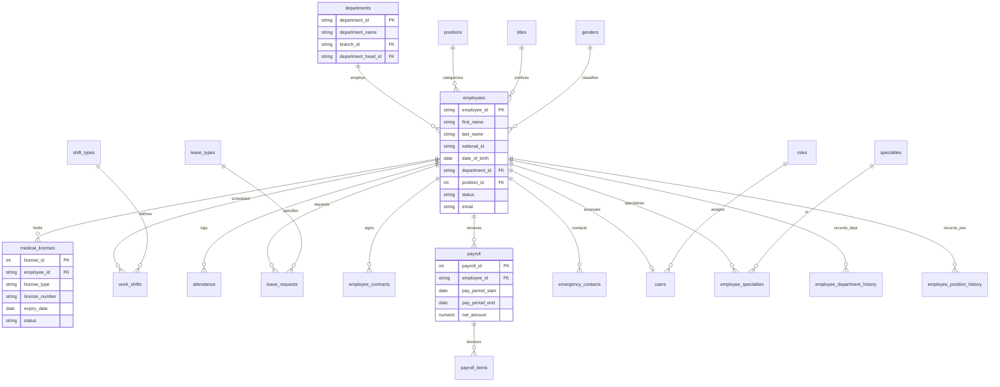
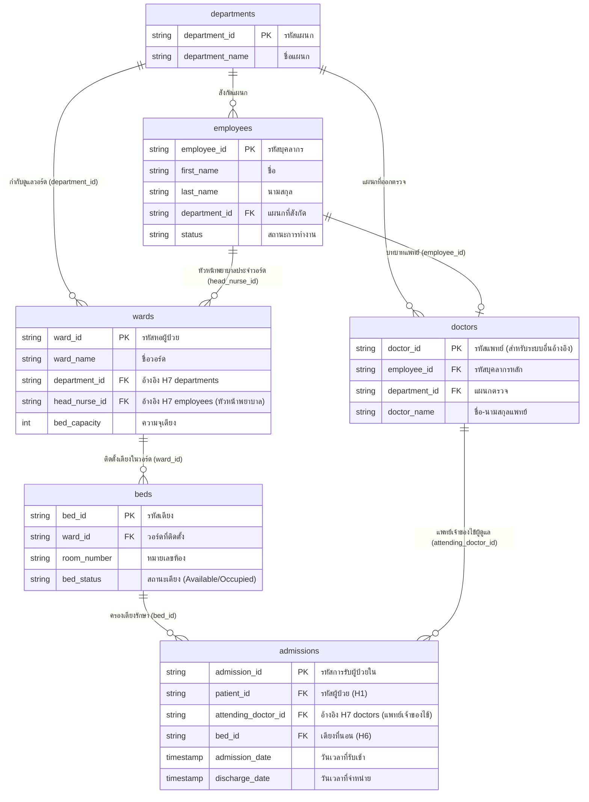

# 📊 แผนภาพ ER Diagram โมดูล H7: ระบบบริหารบุคลากร และการบูรณาการร่วมกับ H6 (ผู้ป่วยใน)
**ผู้รับผิดชอบ:** สมาชิก H7 (ระบบบริหารบุคลากรทางการแพทย์และเจ้าหน้าที่)  
**มาตรฐานการออกแบบ:** 3NF (Third Normal Form), ปราศจาก M:N โดยตรง, ควบคุม Referential Integrity ครบถ้วน  

---

## 1. แผนภาพที่ 1: ระบบย่อย H7 เดี่ยวๆ (H7 Standalone ER Diagram)
*แสดงโครงสร้าง 22 ตารางของระบบบริหารทรัพยากรบุคคลและบุคลากรทางการแพทย์*

---

## 2. แผนภาพที่ 2: การบูรณาการข้ามระบบ H7 (บุคลากร) + H6 (ผู้ป่วยในและวอร์ด)
*แสดงจุดเชื่อมโยงสำคัญ (Inter-system Foreign Keys) ระหว่างแพทย์/พยาบาล (H7) กับการรับคนไข้และหอผู้ป่วย (H6)*

---

## 3. คำอธิบายจุดเชื่อมโยง (Integration Details)
1. **แพทย์เจ้าของไข้ (Attending Physician):**
   * ตาราง `admissions` ของ H6 มี Foreign Key `attending_doctor_id` ชี้ไปยัง `staff_system.doctors(doctor_id)` ซึ่งเชื่อมโยงต่อไปยัง `staff_system.employees(employee_id)` ของ H7 เพื่อให้ทราบประวัติและคุณวุฒิของแพทย์ผู้รักษา
2. **หัวหน้าพยาบาลประจำวอร์ด (Head Nurse Assignment):**
   * ตาราง `wards` ของ H6 มี Foreign Key `head_nurse_id` ชี้มายัง `staff_system.employees(employee_id)` เพื่อระบุพยาบาลวิชาชีพผู้รับผิดชอบการบริบาลในแต่ละหอผู้ป่วย
3. **แผนกทางการแพทย์ (Clinical Department Hierarchy):**
   * ตาราง `wards` ของ H6 อ้างอิง `department_id` มายังตาราง `staff_system.departments` ของ H7 เพื่อไม่ให้เกิดตารางแผนกซ้ำซ้อนตามหลัก 3NF
