# 📊 แผนภาพ ER Diagram กลางฉบับสมบูรณ์: บูรณาการระบบ H7 (บุคลากร) และ H6 (ผู้ป่วยใน) ครบทุกตาราง
**ผู้รับผิดชอบ:** สมาชิก H7 (ระบบบริหารบุคลากร) และ H6 (ระบบผู้ป่วยใน/วอร์ด)  
**มาตรฐานการออกแบบ:** 3NF (Third Normal Form) ครบทุก Entity ไม่มีตารางซ้ำซ้อน และแสดง Foreign Key ข้ามระบบทั้งหมด  

---

## 🏛️ แผนภาพรวมทุกตารางของทั้ง 2 ระบบ (Complete Unified ER Diagram)
*รวบรวมตารางทั้งหมดของระบบบุคลากร H7 (22 ตาราง) และระบบผู้ป่วยใน H6 เชื่อมโยงเข้าด้วยกันอย่างสมบูรณ์*

```mermaid
erDiagram
    %% ==========================================
    %% 1. H7 LOOKUP & MASTER TABLES
    %% ==========================================
    titles ||--o{ employees : "prefixes"
    genders ||--o{ employees : "classifies"
    departments ||--o{ employees : "employs"
    positions ||--o{ employees : "assigns"
    departments ||--o{ doctors : "hosts"
    employees ||--o| doctors : "practices_as"
    departments ||--o| employees : "headed_by"

    %% ==========================================
    %% 2. H7 CREDENTIALS & HISTORY
    %% ==========================================
    employees ||--o{ medical_licenses : "holds"
    employees ||--o{ employee_specialties : "specializes"
    specialties ||--o{ employee_specialties : "categorizes"
    employees ||--o{ employee_department_history : "dept_history"
    departments ||--o{ employee_department_history : "historical_dept"
    employees ||--o{ employee_position_history : "pos_history"
    positions ||--o{ employee_position_history : "historical_pos"

    %% ==========================================
    %% 3. H7 SHIFTS, ATTENDANCE & LEAVES
    %% ==========================================
    shift_types ||--o{ work_shifts : "defines"
    employees ||--o{ work_shifts : "scheduled"
    work_shifts ||--o{ attendance : "references"
    employees ||--o{ attendance : "attends"
    leave_types ||--o{ leave_requests : "categorizes"
    employees ||--o{ leave_requests : "applies"
    employees ||--o{ leave_requests : "approves"

    %% ==========================================
    %% 4. H7 PAYROLL, CONTRACTS & SECURITY
    %% ==========================================
    employees ||--o{ employee_contracts : "signs"
    employees ||--o{ payroll : "receives"
    payroll ||--o{ payroll_items : "itemizes"
    employees ||--o{ emergency_contacts : "contacts"
    employees ||--o| users : "authenticates"
    roles ||--o{ users : "authorizes"
    users ||--o{ audit_logs : "audited"

    %% ==========================================
    %% 5. H6 WARDS, BEDS & ADMISSIONS
    %% ==========================================
    departments ||--o{ wards : "manages (department_id)"
    wards ||--o{ beds : "installs (ward_id)"
    beds ||--o{ admissions : "occupies (bed_id)"
    admissions ||--o{ bed_transfers : "transfers (admission_id)"
    beds ||--o{ bed_transfers : "from_bed"
    beds ||--o{ bed_transfers : "to_bed"
    admissions ||--o{ admissions_audit : "logs_audit"

    %% ==========================================
    %% 6. CROSS-MODULE FOREIGN KEYS (H7 <--> H6)
    %% ==========================================
    doctors ||--o{ admissions : "attending_doctor_id"
    employees ||--o{ wards : "head_nurse_id"

    %% ==========================================
    %% ENTITY ATTRIBUTE DEFINITIONS
    %% ==========================================
    titles {
        int title_id PK
        string title_name
    }

    genders {
        int gender_id PK
        string gender_name
    }

    shift_types {
        int shift_type_id PK
        string shift_name
        time start_time
        time end_time
    }

    specialties {
        int specialty_id PK
        string specialty_name
    }

    leave_types {
        int leave_type_id PK
        string leave_name
        int max_days_per_year
    }

    roles {
        int role_id PK
        string role_name
    }

    departments {
        string department_id PK
        string branch_id FK
        string department_name
        string contact_number
        string department_head_id FK
    }

    positions {
        int position_id PK
        string position_name
        numeric base_salary
    }

    employees {
        string employee_id PK
        int title_id FK
        int gender_id FK
        string first_name
        string last_name
        string national_id
        date date_of_birth
        date hire_date
        string department_id FK
        int position_id FK
        string status
        string phone
        string email
    }

    doctors {
        string doctor_id PK
        string employee_id FK
        string department_id FK
        string doctor_name
        numeric salary_thb
        string position
    }

    medical_licenses {
        int license_id PK
        string employee_id FK
        string license_type
        string license_number
        date issued_date
        date expiry_date
        string status
    }

    employee_specialties {
        string employee_id PK
        int specialty_id PK
        date certified_date
    }

    employee_department_history {
        int history_id PK
        string employee_id FK
        string department_id FK
        date start_date
        date end_date
    }

    employee_position_history {
        int history_id PK
        string employee_id FK
        int position_id FK
        date start_date
        date end_date
    }

    work_shifts {
        int shift_id PK
        string employee_id FK
        date shift_date
        int shift_type_id FK
    }

    attendance {
        int attendance_id PK
        string employee_id FK
        int shift_id FK
        date work_date
        timestamp check_in_time
        timestamp check_out_time
        string status
    }

    leave_requests {
        int leave_request_id PK
        string employee_id FK
        int leave_type_id FK
        date start_date
        date end_date
        string status
        string approved_by FK
    }

    employee_contracts {
        int contract_id PK
        string employee_id FK
        string contract_type
        date start_date
        date end_date
        boolean is_active
    }

    payroll {
        int payroll_id PK
        string employee_id FK
        date pay_period_start
        date pay_period_end
        numeric net_amount
        string status
    }

    payroll_items {
        int payroll_item_id PK
        int payroll_id FK
        string item_type
        string item_name
        numeric amount
    }

    emergency_contacts {
        int contact_id PK
        string employee_id FK
        string contact_name
        string relationship
        string phone_number
    }

    users {
        string user_id PK
        string employee_id FK
        string username
        string password_hash
        int role_id FK
        boolean is_active
    }

    audit_logs {
        int audit_id PK
        string user_id FK
        string action
        string table_name
        string record_id
        timestamp created_at
    }

    wards {
        string ward_id PK
        string department_id FK
        string ward_name
        string ward_type
        int bed_capacity
        string head_nurse_id FK
    }

    beds {
        string bed_id PK
        string ward_id FK
        string room_number
        string bed_type
        string bed_status
    }

    admissions {
        string admission_id PK
        string patient_id FK
        string attending_doctor_id FK
        string bed_id FK
        timestamp admission_date
        timestamp discharge_date
        string admission_type
        string discharge_status
        int length_of_stay_days
    }

    bed_transfers {
        int transfer_id PK
        string admission_id FK
        string from_bed_id FK
        string to_bed_id FK
        timestamp transfer_timestamp
        string transfer_reason
    }

    admissions_audit {
        int audit_id PK
        string admission_id FK
        string operation
        jsonb new_data
        timestamp logged_at
    }
```

---

## 🔗 สรุปจุดเชื่อมโยงสำคัญระหว่าง H7 และ H6
1. **`staff_system.doctors` $\leftrightarrow$ `ipd_system.admissions`:**
   * คอลัมน์ `attending_doctor_id` ในตาราง `admissions` เป็น Foreign Key ชี้มาที่ `doctor_id` เพื่อระบุแพทย์เจ้าของไข้
2. **`staff_system.employees` $\leftrightarrow$ `ipd_system.wards`:**
   * คอลัมน์ `head_nurse_id` ในตาราง `wards` เป็น Foreign Key ชี้มาที่ `employee_id` เพื่อระบุพยาบาลหัวหน้าวอร์ด
3. **`staff_system.departments` $\leftrightarrow$ `ipd_system.wards`:**
   * คอลัมน์ `department_id` ในตาราง `wards` เป็น Foreign Key ชี้มาที่ `department_id` ของฝ่ายบุคคล เพื่อกำกับดูแลหอผู้ป่วยตามสายงาน
